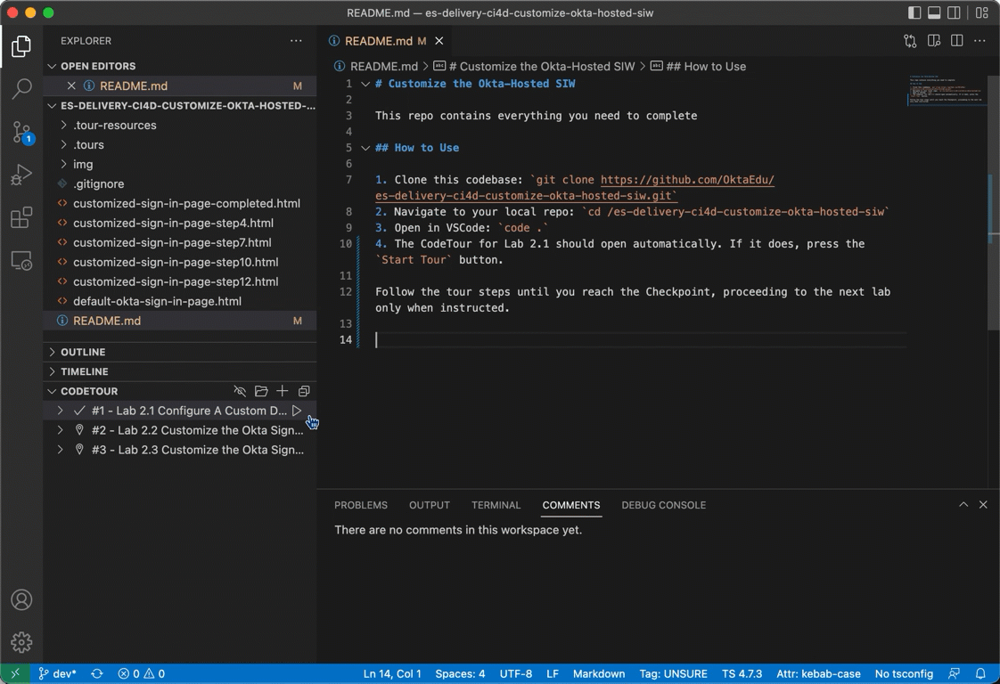

# Lab Node Template

An Okta Training lab template for Customer Identity courses. Replace this section with the title of your Module and a brief description.

## How to Start the Labs

These labs are guided by a VSCode plugin called CodeTour. To start Lab X.1, first expand the **CODETOUR** tab on the lefthand side of VSCode. Then press the  button next to Lab X.1.

Follow the tour steps until you reach the Checkpoint, proceeding to the next lab only when instructed.
